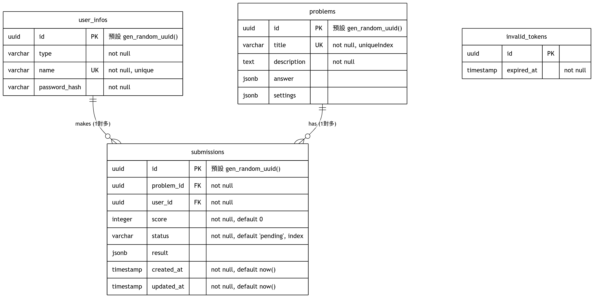

# CS3060701 後端系統開發實務 OJ Backend

這是一個基於 Go 語言建立的 Online Judge (線上解題系統) 後端，並利用 Docker 作為沙盒環境以安全地執行程式碼。

## 專案結構
- `server/`: 核心後端應用程式。
  - `src/`: Go 原始碼，包含路由 (Routes)、資料庫設定 (Database) 以及沙盒邏輯 (Sandbox)。
  - `compiler/` & `runner/`: 用於程式碼執行沙盒的 Dockerfile。
- `problems/`: 用於存放題目描述與測試測資 (Test cases) 的資料夾。
- `submissions/`: 用於存放使用者提交之程式碼的資料夾。
- `docker-compose.yaml`: 用於一鍵啟動後端與資料庫服務的 Docker 配置檔。

## 如何開始

### 系統需求
- Docker 與 Docker Compose
- Go 1.26+ (如果您希望在不使用 Docker 的情況下進行本地開發)

### 環境設定與啟動

1. **環境變數**:
   複製專案提供的 `.env.template` 檔案並命名為 `.env`，接著根據您的需求設定當中的環境變數。
   ```sh
   cp .env.template .env
   ```

2. **啟動服務**:
   您可以使用專案提供的腳本來快速啟動後端與相依服務：
   ```sh
   chmod +x start.sh
   ./start.sh
   ```
   *（註：`start.sh` 腳本會先自動建置所需的編譯器及執行器 docker 映像檔，然後再啟動 docker-compose）。*

   您也可以選擇手動執行以下指令來啟動：
   ```sh
   docker build ./server/compiler -t compiler
   docker build ./server/runner -t runner
   docker compose --env_file=.env up -d
   ```

## 本地開發
如果想使用本地的 Go 執行後端伺服器，可以選擇在 Docker 中只啟動 PostgreSQL 資料庫：

```sh
# 單獨啟動資料庫
docker compose --env-file=.env up -d db 

# 切換至後端程式碼目錄
cd server/src
go mod download

# 載入根目錄的 .env 變數並執行伺服器
export $(grep -v '^#' ../../.env | xargs) && go run main.go
```

## API 文件 (Swagger)
本專案已整合 Swagger UI 以方便手動測試 API。
當您啟動後端伺服器後，可以直接透過瀏覽器存取 [Swagger 介面](http://localhost:8080/swagger/index.html)。

> 若新增或修改 API，請在對應的 handler 函數加上 Swagger 註解，並在 `server/src` 目錄下重新產生文件。
>
> **如何產生 Swagger 文件：**
> 1. 如果你還沒有安裝 `swag` 指令列工具，請先安裝：
>    ```sh
>    go install github.com/swaggo/swag/cmd/swag@latest
>    ```
> 2. 在 `server/src` 目錄下執行以下指令更新文件：
>    ```sh
>    $(go env GOPATH)/bin/swag init
>    ```

## ERD


## Swagger
查看 [swagger.json](./server/src/docs/swagger.json)
